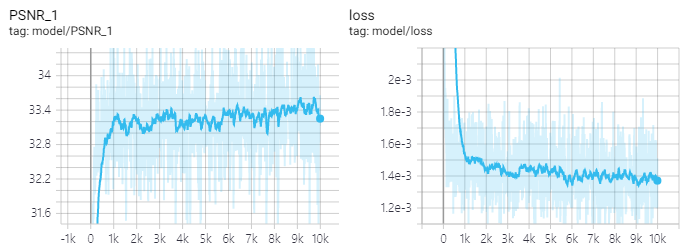
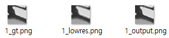

# srcnn
* SRCNN tensorflow implementation
* Hanyang University ITE4053 Deep Learning Methods and Applications assignment #1

## Result

* Set5 loss: 0.0004277987754903734
* Set5 PSNR: 34.9572868347168

## Requirements
* Python 3.6+
* TensorFlow 1.13
* NumPy
* imageio

## Detail
* 32x32x1 input (random cropped from original images)
* 32x32x1 output
* 3x3 kernel
* number of epoch=10000
* mini batch size=128

## References
* Original paper
    * [Image Super-Resolution Using Deep Convolutional Networks](https://arxiv.org/abs/1501.00092)
* My program architecture is inspired by the tutorials and examples of Stanford cs230
    * https://github.com/cs230-stanford/cs230-code-examples
    * https://cs230-stanford.github.io/tensorflow-input-data.html
* tf Dataset
    * https://www.tensorflow.org/guide/datasets

## Problems and solutions
클리핑
* Low resolution, ground truth, srcnn output 세 개의 이미지를 출력해보니, 가끔 일부 이미지의 명도가 ground truth와 지나치게 차이나는 경우가 발생
* 교수님께 여쭤본 결과, 변환 과정에서 데이터가 원래 범위(0~255)를 초과해서 생기는 문제일 수도 있음
* 실제로 변환 과정에서 음수 데이터가 간혹 발생하는데, 이때 이미지의 밝기가 이상해짐을 확인할 수 있었음
* 해결: tf.clip_by_value를 사용해서 0.0~1.0으로 클리핑

Dataset
* tf.dataset에서 repeat의 동작때문에 큰 혼돈이 발생
* shuffle과 repeat(n_epoch)과 batch(n_batch)을 순서대로 썼다고 하자
* dataset initializer가 불릴 때마다(예를들어 epoch가 시작할 때마다) 새로 shuffle된 batch가 반환됨
* 이러한 배칭은 최대 n_epoch번까지 가능. 빈 칸으로 두면 무한대로 가능